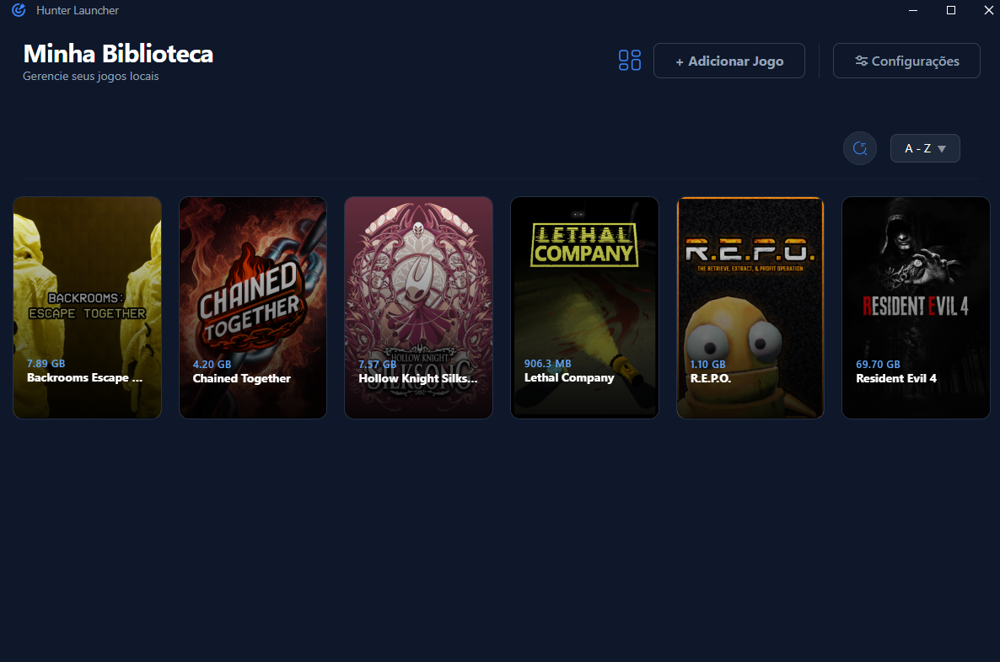
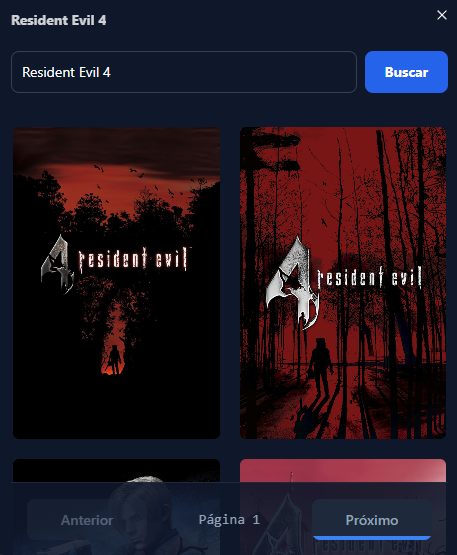

# 🎮 Hunter Launcher


**Hunter Launcher** é um launcher de jogos moderno e leve, focado na estética e na facilidade de organizar sua biblioteca de jogos. Desenvolvido com Python e tecnologias web, ele oferece uma interface fluida e integração com API do [SteamGridDB](https://www.steamgriddb.com/) para a busca de capas.





## ⬇️ Faça o download do executável Hunter Launcher
- Acesse: [Hunter Launcher](https://github.com/CaioMonteir0/Hunter-Launcher/releases)

- Realize o download do .exe da versão mais atual.


## Criando sua conta no [SteamGridDB](https://www.steamgriddb.com/)
- Crie sua conta e vá para as configurações em `Preferences`
- Na aba `API` do site, gere sua chave, copie e cole na aba de `API & INTEGRAÇÃO` no menu de configurações do launcher.

> ⚠️ **Aviso:** Não compartilhe sua chave com terceiros. Essa chave é de uso pessoal e exclusivo seu.


## ✨ Funcionalidades

- 🕹️ **Iniciando jogos:** Você pode iniciar os jogos no ícone ▶️ ou com duplo clique no card.
- 🚀 **Biblioteca Centralizada:** Organize todos os seus jogos em um só lugar.
- 🔎 **Filtros de busca:** Filtre seus jogos por ordem alfabética ou por tamanho.
- 🖼️ **Capas Automáticas:** Integração com a API do [SteamGridDB](https://www.steamgriddb.com/) para buscar capas e artes oficiais.
- 🔎🖼️ **Suporte a busca manual de capas:**

     
- ⚡ **Performance:** Interface rápida construída com Tailwind CSS e carregamento dinâmico.
- 🎬 **Splash Screen:** Introdução cinematográfica com suporte a skip.
- 🔒 **Configurações Seguras:** Gerenciamento de chaves de API e caminhos de biblioteca.


## 📂 Onde ficam os dados?

O Hunter Launcher armazena o banco de dados de jogos e as configurações em uma pasta oculta do sistema para garantir a segurança e persistência dos dados:

- **Localização:** `%APPDATA%\HunterLauncher`
- **Como acessar:**
  1. Pressione `Win + R` no seu teclado.
  2. Digite `%APPDATA%\HunterLauncher` e pressione `Enter`.

Dentro desta pasta, você encontrará:
- `games.json`: O banco de dados com seus jogos.
- `settings/config.json`: Suas configurações (como a chave da API).
- `covers/`: A pasta onde ficam armazenadas as capas dos seus jogos.

## 🛠️ Tecnologias Utilizadas

- **Linguagem:** [Python 3](https://www.python.org/)
- **Frontend:** HTML5, CSS3 (Tailwind CSS), JavaScript (ES6)
- **GUI Framework:** [pywebview](https://pywebview.flowrl.com/)
- **Renderização 3D:** Google Model Viewer
- **Ícones:** SVG dinâmicos


## 🚀 Como executar a build do Projeto

### Pré-requisitos
**Certifique-se de ter:**

**Python 3.10** ou superior instalado.
 
**pip**: O gerenciador de pacotes do Python. Ele é essencial para baixar as bibliotecas necessárias que permitem ao Launcher comunicar com APIs e gerenciar imagens.
1. **Clone o repositório:**
   ```bash
   git clone [https://github.com/CaioMonteir0/Hunter-Launcher.git](https://github.com/CaioMonteir0/Hunter-Launcher.git)
   cd Hunter-Launcher

2. **Instale as dependências:**
   ```bash
   pip install -r requirements.txt

3. **Inicie o Launcher:**
   ```bash
   python main.py


### 🫡 Caso tenha interesse em conhecer o projeto do SteamGridDB:
**GitHub: [SteamGridDB](https://github.com/SteamGridDB)**
---
### 💼 Projeto desenvolvido por


| **Autor** | Caio Monteiro |
| :--- | :--- |
| **LinkedIn** | [Clique aqui](https://www.linkedin.com/in/caio-araujo-4ab4591b8/) |
| **GitHub** | [Acesse o perfil](https://github.com/CaioMonteir0) |
